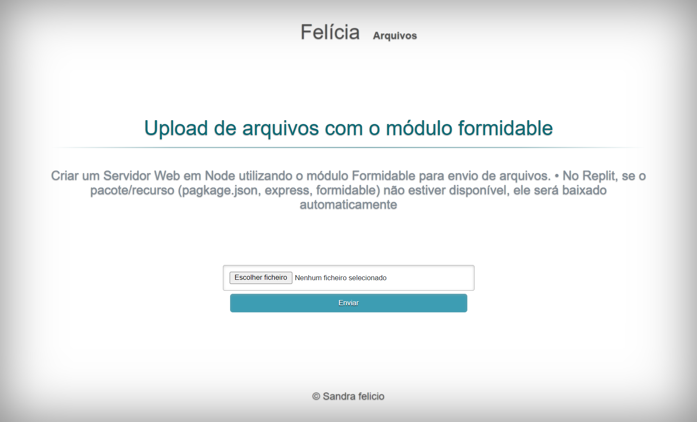

## Instituto Federal do Espírito Santo
 ## 2024-F2M2: Criação de páginas customizadas com Node.js

                 Welcome! 👋

## Índice

- Desafio
- Links
- Tecnologias usadas
- O que eu aprendi
- Recursos úteis
- Desafio
- layout ideal para a seção, dependendo do tamanho da tela

## Links usados:

- https://youtu.be/sXP08RElyWE?si=dNsyXBVtvO5aBW8D
- https://youtu.be/zZU8qz3-Re0?si=ZDlIm1Xc2PEpzvWv
- https://youtu.be/ohJr3fTIzSk?si=FF-VrFA_L8ogi_Um

## Tecnologias usadas:
- Marcação HTML5 semântica
- CSS
- node express
- Aula 9 - Criando rotas no Servidor Web com uso de URL
- Aula 10 - Criando rotas no Servidor Web utilizando o Express - Parte 1Página
- Aula 11 - Upload de arquivos com o módulo formidable
- Criando rotas no Servidor WebPágina

## O que eu aprendi

- Melhorando as habilidades no CSS
- Marcadores semânticos importantes -Express
- Praticando para melhorar o -  node

## Autor
- @mjpfelicia
